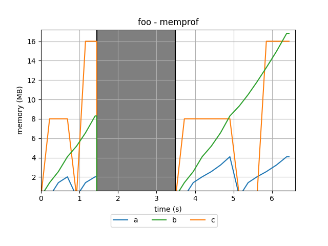

# memprof

`memprof` is a memory profiler for Python. 

It logs and plots the memory usage of all the variables during the execution of the decorated methods.

## Installation
### Stable
    sudo pip install --upgrade memprof
    
or

    sudo easy_install --upgrade memprof
    
### Development
    
    git clone git://github.com/jmdana/memprof.git
    cd memprof
    sudo python setup.py install

## Usage

Using `memprof` is as easy as adding a decorator to the methods that you want to profile:

    @memprof
    def foo():
    
And importing the module just by including the line below at the beginning of your Python file:

    from memprof import *

Now you can run as usual and logfiles with the names of your methods will be created (e.g. `foo.log`).

### Generating plots

The logfiles are not very interesting so you might prefer to use the `-p`/`--plot` flag:
    
    python -m memprof --plot <python_file>
    python -m memprof -p <python_file>
    
Which, in addition to the logfile, will generate a plot (`foo.png`):

The grey bar indicates that the `foo` method wasn't running at that point.

The flag may also be passed as an argument to the decorator:

    @memprof(plot = True)

Please keep in mind that the former takes precedence over the latter.

### Adjusting the threshold

You may also want to specify a `threshold`. The value will be the minimum size for a variable to appear in the plot (but it will always appear in the logfile!). The default value is 1048576 (1 MB) but you can specify a different `threshold` (in bytes) with the `-t`/`--threshold` flag:

    python -m memprof --threshold 1024 <python_file>
    python -m memprof -t 1024 <python_file>
    
The `threshold` may also be passed as an argument to the decorator:

    @memprof(threshold = 1024)

Please keep in mind that the former takes precedence over the latter.    

### mp_plot 

If, after running `memprof`, you want to change the threshold and generate a new plot (or you forgot to use the `-p`/`--plot` flag with `memprof`), you don't have to re-run! Just call the command:
    
    mp_plot [-h] [-t THRESHOLD] logfiles [logfiles ...]
    
and generate the plots again doing something like:

    mp_plot -t 128 logfile1.log logfile2.log
    
or:
 
    mp_plot -t 1024 *.log
    
etc.

## Contact

### Mailing list

* Subscribe by sending a message to <memprof+subscribe@googlegroups.com>
* Once subscribed, you can send emails to <memprof@googlegroups.com>
* List archives at http://groups.google.com/group/memprof

---
Copyright 2013, Jose M. Dana

